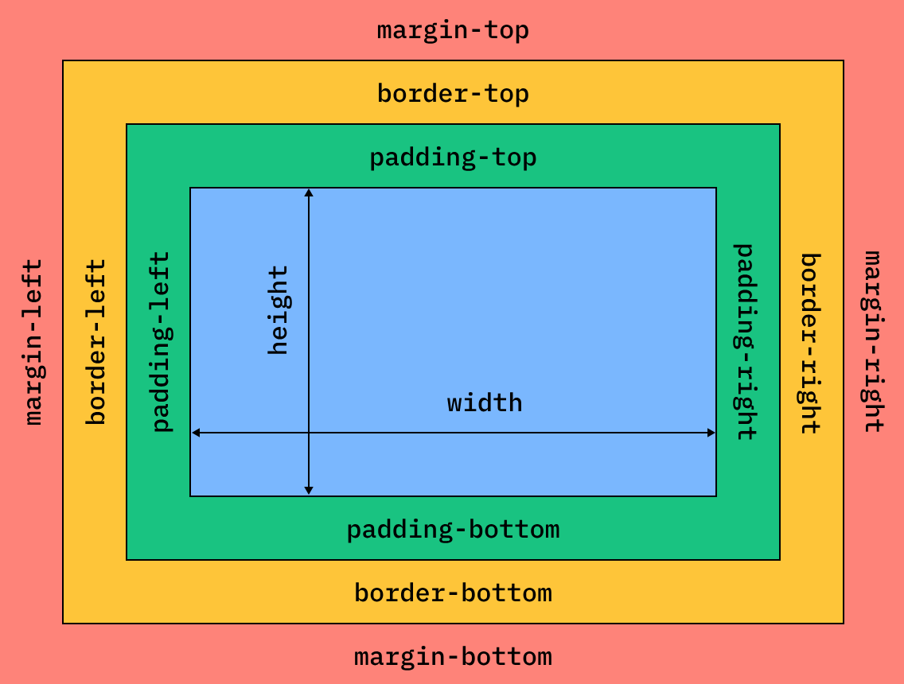
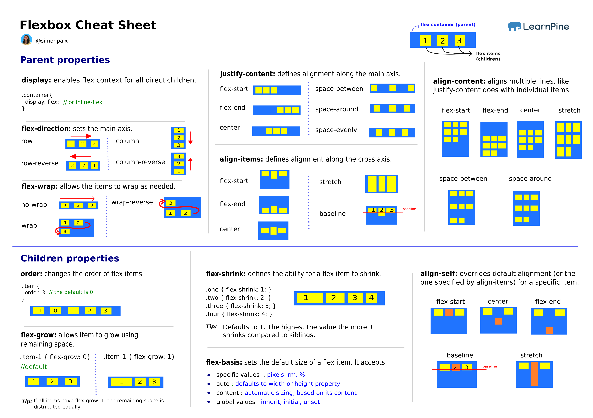
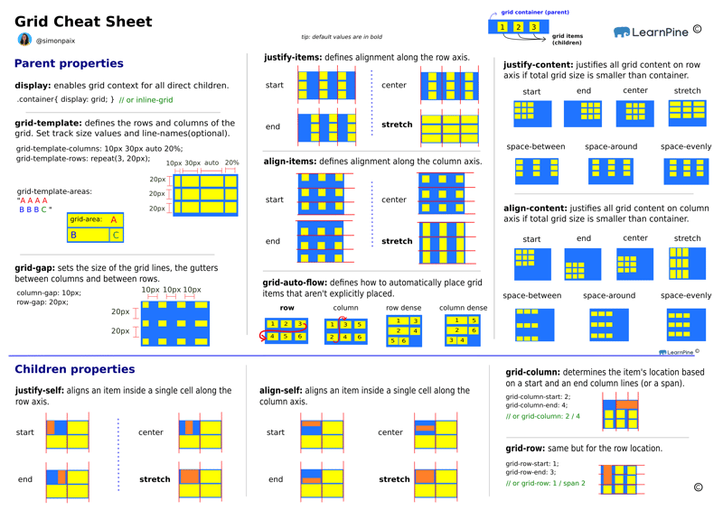

# Welcome 🙋‍♂️ to CSS 🎨

### [🔙 Back To Main Readme](../../../README.md) 👈

## Table of Contents

- [Welcome 🙋‍♂️ to CSS 🎨](#welcome-️-to-css-)
    - [🔙 Back To Main Readme 👈](#-back-to-main-readme-)
  - [Table of Contents](#table-of-contents)
  - [1️⃣ Adding CSS to HTML](#1️⃣-adding-css-to-html)
  - [2️⃣ CSS Selectors](#2️⃣-css-selectors)
    - [🛎️ **There are different types of selectors:**](#️-there-are-different-types-of-selectors)
      - [🪝Most Common Selectors](#most-common-selectors)
      - [🪝Pesudo Selectors](#pesudo-selectors)
      - [⚠️ **Combinining selectors:**](#️-combinining-selectors)
  - [3️⃣ CSS Properties](#3️⃣-css-properties)
  - [4️⃣ CSS Colors 🎨](#4️⃣-css-colors-)
  - [5️⃣ CSS Text](#5️⃣-css-text)
  - [6️⃣ CSS Inspection Chrome dev tools](#6️⃣-css-inspection-chrome-dev-tools)
  - [7️⃣ CSS Box Model](#7️⃣-css-box-model)
    - [🧲 Properties of the box model:](#-properties-of-the-box-model)
  - [9️⃣ Type of Boxes 📦](#9️⃣-type-of-boxes-)
  - [1️⃣0️⃣ CSS Image](#1️⃣0️⃣-css-image)
  - [1️⃣1️⃣ CSS Container](#1️⃣1️⃣-css-container)
  - [1️⃣2️⃣ CSS Cascading](#1️⃣2️⃣-css-cascading)
  - [1️⃣3️⃣ CSS Units 📏](#1️⃣3️⃣-css-units-)
  - [1️⃣4️⃣ CSS Position 🔖](#1️⃣4️⃣-css-position-)
    - [Static Position](#static-position)
    - [Relative Position](#relative-position)
    - [Absolute Position](#absolute-position)
    - [Fixed Position](#fixed-position)
    - [Sticky Position](#sticky-position)
  - [1️⃣5️⃣ 🧩 CSS Flexbox](#1️⃣5️⃣--css-flexbox)
  - [1️⃣6️⃣ 🥅 CSS Grid](#1️⃣6️⃣--css-grid)
    - [🔙 Back To Main Readme 👈](#-back-to-main-readme--1)

## 1️⃣ Adding CSS to HTML 

**We can add css in 3 ways:**

1. Inline css `<tag style="property: value;">`
2. Internal css `<style>css code</style>` in head tag
3. External css `<link rel="stylesheet" href="path">` 
   1. Add this to head tag and css file live in separate folder/file .
   2. for file path remember relative path.

**Note the order of precedence of css (CSS Specificity)**:

1- Inline css
2- Internal css
3- External css

**So inline css will override internal css and internal css will override external css.** 📢

## 2️⃣ CSS Selectors

**Css selecto is a pattern to select the elements you want to style.**

The pattern is like this:

```css
selector {
  property: value;
}
```

### 🛎️ **There are different types of selectors:**

#### 🪝Most Common Selectors 

- **Element / Tag selector** 
  - Pattern `tag { property: value; }`
  - ex: `p { color: red; }` 
  - Will make **all paragraph** red
- **Class selector** (class used as group of elements)
  - ex: `.red-text { color: red; }` 
  - Hint: _no space between . and class name_ 
  - Will make **all elements with class red-text** red, remember to add class to element `<tag class="red-text">`
- **ID selector** (id used for unique element)
  - ex: `#title { color: red; }` 
  - Hint: _no space between # and id name_ 
  - Will make **element with id title** red, remember to add id to element `<tag id="title">`
  - Generally you should **avoid** using id in html because it is not reusable, use class instead.
- **Attribute selector / Attribute value selector**
  - ex: `tag[attribute] { color: red; }` 
  - Will make **all elements of tag specified that contains specified attribute** red
  - ex: `a[href] { color: red; }` will make **all anchor tags that contains href attribute** red
  - ex: `a[href="https://www.google.com"] { color: red; }` will make **all anchor tags that contains href attribute with value https://www.google.com** red
- **Chain selector** _(used to select element that has multiple classes)_
  - you just write selectors after each other without space
  - ex: `.red-text.bold-text { color: red; font-weight: bold; }` will make **all elements that have both red-text and bold-text classes** red and bold
  - ex: `h1#title.red-text { color: red; }` will make **h1 element with id title and red-text class** red
- **Universal selector** 
  - Pattern `* { property: value; }`
  - ex: `* { color: red; }` will make **all elements** red.
  

#### 🪝Pesudo Selectors 

- **Pseudo class selector** _(About state)_
  - used to style a special **state** of an element
  - it can be applied to any element, check complete list at [MDN](https://developer.mozilla.org/en-US/docs/Web/CSS/Pseudo-classes). 
  - **Hint:** you can use not() to inverse selection
  - ex: `a:hover { color: red; }` will make **all anchor tags that are hovered** red
  - ex: `input:disabled {background-color: red;} ` will make **all disabled input** red
  - ex: `input:not(:disabled) {background-color: red;} ` will make **all input that are not disabled** red
  - ex: `a:visited { color: red; }` will make **all anchor tags that are visited** red
  - ex: `a:active { color: red; }` will make **all anchor tags that are active** red
  - ex: `a:focus { color: red; }` will make **all anchor tags that are focused** red
  - ex: `a:link { color: red; }` will make **all anchor tags that are linked** red
  - ex: `li:nth-child(odd) { color: red; }` will make **all odd li** red
  - ex: `li:nth-child(even) { color: red; }` will make **all even li** red
  - ex: `li:nth-child(3) { color: red; }` will make **all third li** red
  - ex: `li:nth-child(3n) { color: red; }` will make **all li that are multiple of 3** red
- **Pseudo element selector** _(About parts of element)_
  -  used to style a part of an element, check complete list at [MDN](https://developer.mozilla.org/en-US/docs/Web/CSS/Pseudo-elements)
  - ex: `p::first-line { color: red; }` will make **first line of all p** red
  - ex: `p::first-letter { color: red; }` will make **first letter of all p** red
  - ex: `p::before { content: "Hello"; }` will add **Hello before all p**
  - ex: `p::after { content: "Hello"; }` will add **Hello after all p**
  - ex: we can chain pseudo elements like this `p::first-line::first-letter { color: red; }`
  - ex: `input::placeholder { color: red; }` will make **placeholder of all input** red
  - ex: `p::selection { color: red; }` will make **selected text of all p** red
  - ex: `li:nth-child(odd)::firstletter { color: red; }` will make **first letter of all odd li** red

#### ⚠️ **Combinining selectors:**

- **Grouping selector** 
  - apply style to multiple selectors
  - ex: `h1, h2, h3 { color: red; }` will make **all h1, h2, h3** red
- **Descendant selector / Nested selector** 
  - apply style to all elements inside another element, regardless of how deep they are nested
  - ex: `div p { color: red; }` will make **all p inside div** red
- **Child selector**
  - apply style to direct child of another element, not all descendants
  - ex: `div > p { color: red; }` will make **all p that are direct child of div** red
  - **Note** the difference between descendant and child selector is that 
    - descendant will select all p inside div
    - child will select only direct child of div
    - so in descendant selector p inside div inside another div will be selected but in child selector it will not be selected.
  - This how the html should look like for descendant selector: and the css will make all p red
    ```html
    <div>
      <p>Paragraph</p>
      <div>
        <p>Paragraph</p>
      </div>  
    </div>
    ```
  - This how the html should look like for child selector: and the css will make only the first p red
    ```html
    <div>
      <p>Paragraph</p>
    </div>
    ```
- **Adjacent sibling selector**
  - apply style to element that is immediately after another element, not all siblings, only the first one
  - sibling means elements that are on the same level, children of the same parent
  - ex: `h1 + p { color: red; }` will make **all p that are immediately after h1** red
  - This how the html should look like:
    ```html
    <h1>Heading</h1>
    <p>Paragraph</p>
    ```
- **General sibling selector** `h1 ~ p { color: red; }`
  - apply style to all siblings of another element
  - ex: `h1 ~ p { color: red; }` will make **all p that are siblings of h1** red
  - This how the html should look like:
    ```html
    <h1>Heading</h1>
    <p>Paragraph</p>
    <p>Paragraph</p>
    ```
- **Combine combiners**  _(you can combine multiple selectors)_
  - ex: `.classa.classb { color: red; }` will make **all elements that have both classa and classb classes** red
  - ex: `.classa .classb { color: red; }` will make **all elements with classb nested inside elements with classa** red
  - ex: `div p.red-text { color: red; }` will make **all p with red-text class inside div** red
  - ex: `div > p.red-text { color: red; }` will make **all p with red-text class that are direct child of div** red
  - ex: `div + p.red-text { color: red; }` will make **all p with red-text class that are immediately after div** red
  - ex: `div ~ p.red-text { color: red; }` will make **all p with red-text class that are siblings of div** red
  - ex: `a:hover::before { content: "Hello"; }` will add **Hello before all anchor tags that are hovered**

## 3️⃣ CSS Properties

Pattern of css property is like this:

```css
selector {
  property: value; //This is called declaration
}
```

## 4️⃣ CSS Colors 🎨

There are different ways to specify color in css:

- **Color name**
  - ex: `color: red;`
  - For a list of color names check [MDN color names](https://developer.mozilla.org/en-US/docs/Web/CSS/named-color)
- **Hexadecimal**
  - ex: `color: #ff0000;`
- **RGB** 
  - `Red Green Blue` values between 0 and 255, where 0 is no color and 255 is full color
  - ex: `color: rgb(255, 0, 0);`
- **RGBA** 
  - `Red Green Blue Alpha`
    - alpha is transparency value between 0 and 1, where 0 is fully transparent and 1 is fully opaque
  - ex: `color: rgba(255, 0, 0, 0.5);`
- **HSL** 
  - `Hue Saturation Lightness`
    - hue is color between 0 and 360 
    - saturation is intensity of color between 0% and 100% where 0% is gray and 100% is full color
    -  lightness is brightness between 0% and 100% where 0% is black and 100% is white
  - ex: `color: hsl(0, 100%, 50%);`
- **HSLA** 
  - `Hue Saturation Lightness Alpha` 
    - alpha is transparency value between 0 and 1, where 0 is fully transparent and 1 is fully opaque
  - ex: `color: hsla(0, 100%, 50%, 0.5);`
- **Gradient** 
  - used to create gradient color
  - ex: `background: linear-gradient(to right, red, yellow);` 
    - will create **gradient color from red to yellow from left to right**
  - ex: `background: linear-gradient(to right, red 0%, yellow 100%);` 
    - will create **gradient color from red to yellow from left to right with red at 0% and yellow at 100%**
  - ex: `background: linear-gradient(to right, red 0%, yellow 50%, green 100%);` 
    - will create **gradient color from red to yellow to green from left to right with red at 0%, yellow at 50% and green at 100%**
- **Opacity** 
  - used to make element transparent
  - ex: `opacity: 0.5;` will make **element 50% transparent**
- **Transparent** 
  - used to make element transparent
  - ex: `background: transparent;` will make **element background transparent**
- Check these web sites for easy color picking:
  - [Coolors](https://coolors.co/)
  - [Color Hunt](https://colorhunt.co/)
- Check foreground and background color contrast, it should be at least 4.5:1 for normal text and 3:1 for large text
  - [WebAIM](https://webaim.org/resources/contrastchecker/)

## 5️⃣ CSS Text

- **Text color** 
  - Note it is `color` not `text-color`
  - ex: `color: red;`
- **Text size** 
  - Note it is `font-size` not text-size
  - ex: `font-size: 16px;`
- **Font family** 
  - Note it is not `text-family`
  - ex: `font-family: Arial, sans-serif, 'Times New Roman';`
  - serif is the font with the little feet at the end of the letters
  - sans-serif is the font without the little feet at the end of the letters
  - monospace is the font where all the letters have the same width
  - cursive is the font that looks like handwriting
  - Check [Google Fonts](https://fonts.google.com/) for free fonts
- **Font weight** 
  - Note it is not text-weight
  - ex: `font-weight: bold;`
  - 100 is thin, 400 is normal, 700 is bold, 900 is black
  - it can be normal, bold, bolder, lighter, 100, 200, 300, 400, 500, 600, 700, 800, 900
  - ex: `font-weight: 700;`
  - ex: `font-weight: bolder;`
  - ex: `font-weight: lighter;`
  - The bolder and lighter values are relative to the parent element font weight value. 
    - So if the parent element font weight is 400 and the child element font weight is bolder 
    - then the child element font weight will be 500
    - it adds +100 for bolder and -100 for lighter.
- **Font style** 
  - Note it is not text-style
  - ex: `font-style: italic;`
  - it can be normal, italic, oblique
- **Text align**
  - ex: `text-align: center;`
  - it can be left, right, center, justify
  - There is start and end 
    - start is left for left-to-right languages and right for right-to-left languages 
    - end is right for left-to-right languages and left for right-to-left languages.
    - ex: `text-align: start;`
    - ex: `text-align: end;`
- **Text transform**
  - ex: `text-transform: uppercase;`
  - it can be uppercase, lowercase, capitalize, none
- **Text decoration**
  - ex: `text-decoration: underline;`
  - it can be underline, overline, line-through, none
- **Line height**
  - ex: `line-height: 1.5;`
  - it can be normal, number, length, percentage
  - normal is the default line height of the font with value 1.2
  - number is the multiple of the font size
  - length is the fixed line height
  - percentage is the percentage of the font size

## 6️⃣ CSS Inspection Chrome dev tools

- Right click on element and click inspect
- Check the styles tab
- Check the computed tab
  - It shows the final style of the element after applying all the css rules
- Every element has default style, when you see property with value strikethrough it means it is default style and it is overridden by your css.
- If you like a web site styles you can go to the three dots in dev tools not chrome settings, and then got to more tools and click CSS overview, it will show you the css overview of the web site.

## 7️⃣ CSS Box Model



**Margin, Padding, Border, Content, as well as Width and Height are so important in CSS.**

- Every element in html is like box and if you want to increase or decrease its size you use width and height properties.

- So by default the width and height of the element is the **content** of the element not including padding, border and margin.

- The width of the element is the width of the content of the element.
  - So padding and border are added to the width of the element.
  - This means if you set the width of the element to 100px and padding to 10px, the total width of the element will be 120px.
  - This sometimes causes the element to be bigger than the parent element.
  - If you want to include padding and border in the width and height of the element you can use `box-sizing property with value border-box`.

- The content + padding is the fill area of the element. 
  - So colors and background images are applied to the fill area of the element.

- Analogy of the box model is like a gift box or a picture frame on wall:
  - the content is the gift 
  - the padding is the wrapping paper
  - the border is the ribbon 
  - the margin is the space between the gift box and other gift boxes.

### 🧲 Properties of the box model:

- **Width**
  - ex: `width: 100px;`
  - it can be auto, length, percentage
    - auto is the default width of the element
    - length is the fixed width of the element
    - percentage is the width of the element relative to the parent element width
  - ex: `width: 50%;` is 50% of the parent element width
- **Border** 
  - takes 3 values width style color (space separated)
  - ex: `border: 1px solid red;`
  - width is the thickness of the border
  - style is the style of the border
    - it can be solid, dashed, dotted, double, groove, ridge, inset, outset, none, hidden
  - color is the color of the border
    - refer to the color section for different ways to specify color [CSS Colors](#css-colors-)
  - ex: `border: 1px solid red;`
  - ex: `border: 1px dashed red;`
  - border-top, border-right, border-bottom, border-left 
    - can be used to specify border for specific side, and if the come after border property they will override the border property
  - border-width
    - ex: `border-width: 1px;` this will set the width of all borders
    - it can be thin, medium, thick, length
    - ex: `border-width: 1px 2px 3px 4px;` 
      - this will set the width of top border to 1px, right border to 2px, bottom border to 3px, left border to 4px clock wise direction.
    - ex: `border-width: 1px 2px;` 
      - this will set the width of top and bottom borders to 1px, right and left borders to 2px
- Padding this can be easily understood when there is content
  - ex: `padding: 10px;` pushes the border 10 px from the content
  - it can be length, percentage
- Margin is the space outside the border
  - ex: `margin: 10px;` pushes the border 10 px from the margin of the parent element
  - it can be auto, length, percentage
    - auto is the default margin of the element
    - length is the fixed margin of the element
    - percentage is the margin of the element relative to the parent element width
  - ex: `margin: 10px;`
  - ex: `margin: 10px 20px;` top and bottom margin is 10px, right and left margin is 20px
  - ex: `margin: 10px 20px 30px 40px;` 
    - top margin is 10px, right margin is 20px, bottom margin is 30px, left margin is 40px clock wise direction
  - margin-top, margin-right, margin-bottom, margin-left can be used to specify margin for specific side, and if the come after margin property they will override the margin property
- In developers tools you can see the box model of the element by clicking on the element and going to the style tab
- div can work as invisible box to group elements together
- Extension `Pesticide` for chrome will show you the box model of the elements

## 9️⃣ Type of Boxes 📦

We have 3 types of boxes:

1. **Block level box**, occupy all space they can get

   - ex: `display: block;` and we can change the default display value
   - Takes the full width of **the parent element**
   - Starts from new line, you can't have 2 block level boxes on the same line
   - Can have margin, padding, border
   - ex: div, h1, p, ul, ol, li, form
   - elements are stacked on top of each other vertically

2. **Inline level box**, takes the width of the content

   - ex: `display: inline;` and we can change the default display value
   - Takes the width of **the content**, height and width are ignored.
   - Starts from the same line
   - Can have margin, padding, border **only horizontally**
   - ex: span, a, img, input, button

3. **Inline block level box**, it is inline from outside and behave as block from inside
   - ex: `display: inline-block;` and we can change the default display value
   - Takes the width of **the content**, height and width **are considered**.
   - Starts from the same line, cause no line breaks
   - Can have margin, padding, border
   - ex: input, button

## 1️⃣0️⃣ CSS Image

- Image can be added to html using img tag
  - ex: ``
  - src is the path of the image
  - alt is the description of the image, it is used when the image is not loaded or for screen readers
- height and width can be used to specify the height and width of the image
  - ex: ``
  - height auto to keep the aspect ratio of the image
  - percentage to specify the height and width of the image relative to the parent element

## 1️⃣1️⃣ CSS Container

- Container is a box that contains other boxes
- Container can be created using div tag
  - ex: `<div class="container"></div>`
- Container can be styled using css
  - ex: `.container { width: 100%; margin: 0 auto; }`
  - width 100% to take the full width of the parent element
  - margin 0 for top and bottom and auto for left and right to center the container horizontally
  - so auto in this case is like set margin-left and margin-right to auto which means make the left and right margin equal so the container will be centered horizontally

## 1️⃣2️⃣ CSS Cascading

**When there are multiple css rules applies to the same element, which one will be applied?**

All rules applied but which one wins?

4 factors determine which css rule will be applied: 
    - position
    - specificity
    - type 
    - important. 
    - This order is from `least to most` important.

- Position, the last rule will be applied
  - ex: `p { color: red; color:green; }` will make all p green
  - ex: `p { color: blue; }` will make all p blue if later in the file p is defined again
  - so all p will be blue
- Specificity is the weight of the css rule
  - Inline css has the highest specificity
  - ID selector has higher specificity than class, attribute selector
  - Attribute selector has higher specificity than class selector
  - Class selector or Pseudo selector has higher specificity than element selector
  - Universal selector has the lowest specificity
  - So if element has id, class, and element selector, the id selector will be applied.
  - ex: `p { color: red; }` has lower specificity than `p.red-text { color: green; }`
  - ex: `p { color: red; }` has lower specificity than `#title { color: green; }`
  - ex: `p { color: red; }` has lower specificity than `p { color: green; }`
  - ex: `p { color: red; }` has lower specificity than `* { color: green; }`
- Type we have 3 types external, internal, and inline
  - Inline css has the highest priority
  - Internal css has the second priority
  - External css has the lowest priority
  - So inline css will override internal css and internal css will override external css
- important is used to override all the rules
  - ex: `p { color: red !important; }` will make all p red no matter what other rules are applied
  - ex: `p { color: red; }` has lower priority than `p { color: green !important; }`

Hint: 
- In vs code if you hover over the css selector it will show you the specificity of the selector as three numbers
  - the first number is the number of id selectors 
  - the second number is the number of class, attribute, and pseudo selectors
  -  the third number is the number of element selectors.
- The comparison of the specificity is done from left to right, so the first number is compared first, if they are equal then the second number is compared, if they are equal then the third number is compared.

To summarize the order of precedence of css (CSS Specificity): from heighest to lowest
1- important
2- Inline css
3- ID selector
4- Attribute selector
5- Class selector or Pseudo selector
6- Element selector
7- Universal selector

## 1️⃣3️⃣ CSS Units 📏

**There are two types of units in css:**

- **Absolute units**, they are fixed and do not change
  - ex: px, pt, cm, mm, in
  - px is the most common unit, it is the smallest unit. It is not the same as pixel in screen, it is a reference to the pixel density of the screen. It is roughly equal to 1/96 inch
  - pt is used for print, 1pt = 1/72 inch
  - cm is centimeter
  - mm is millimeter
  - in is inch
- **Relative units**, they are relative to something
  - ex: em, rem, vw, vh, %
  - em is relative to the font size of the parent element
  - rem is relative to the font size of the root element - one of the best units to use
    - If the root font size is 16px and the font size of the element is 2rem then the font size of the element will be 32px.
  - vw is relative to the viewport width
  - vh is relative to the viewport height
  - % is relative to the parent element
    - if it is width 50% it is 50% of the parent element width
    - if it is line-height 50% it is 50% of the font size of the parent element
    - if it is margin or padding 50% it is 50% of the parent element width
    - So make sure you know what the percentage is relative to

## 1️⃣4️⃣ CSS Position 🔖

### Static Position

- This is the default position of the element
- it is positioned according to the normal flow of the document. 
- Top, right, bottom, left, z-index properties have no effect.
- ex: `position: static;`

### Relative Position

- Elements fit into the normal flow of the document
- but they can be offset relative to their normal position 
  - using top, right, bottom, left properties. 
- The element will still occupy the same space as if it were in the normal flow.
- Z-index property can be used to specify the stack order of the element
  - the element with higher z-index will be on top of the element with lower z-index.
Note: it only works with positioned elements (non static elements).
- ex: `position: relative; top: 10px; right: 20px; z-index: 1;`

### Absolute Position

- The element is **removed** from the normal flow of the document
- it is positioned relative to its nearest positioned ancestor (non static). 
- If there is no positioned ancestor it is positioned relative to the initial containing block (html element).
- You can use top, right, bottom, left properties to position the element. ex right 0 will make the element stick to the right of the parent element.

### Fixed Position

- The element is **removed** from the normal flow of the document
- it is positioned relative to the viewport, so it will stay in the same position even if you scroll the page.
- You can use top, right, bottom, left properties to position the element. 
- ex right 0 will make the element stick to the right of the viewport.

### Sticky Position

- The element is treated as relative until it crosses a specified threshold, then it is treated as fixed.
- You can use top, right, bottom, left properties to position the element. ex right 0 will make the element stick to the right of the viewport.
- It is useful for sticky navigation bars.
- ex: `position: sticky; top: 0;` will make the element stick to the top of the viewport when it reaches the top of the viewport.

## 1️⃣5️⃣ 🧩 CSS Flexbox 



## 1️⃣6️⃣ 🥅 CSS Grid 



### [🔙 Back To Main Readme](../../../README.md) 👈
